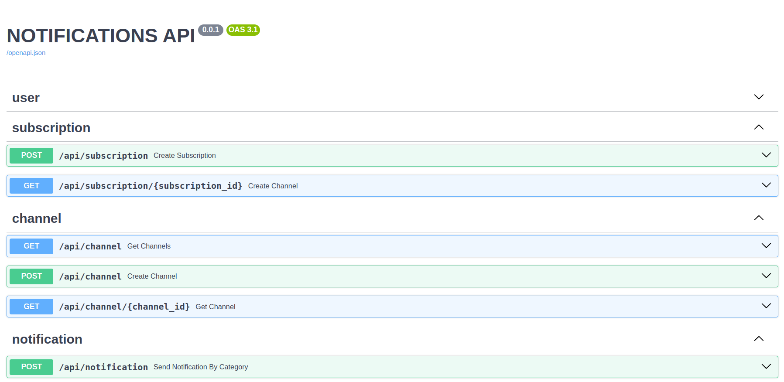
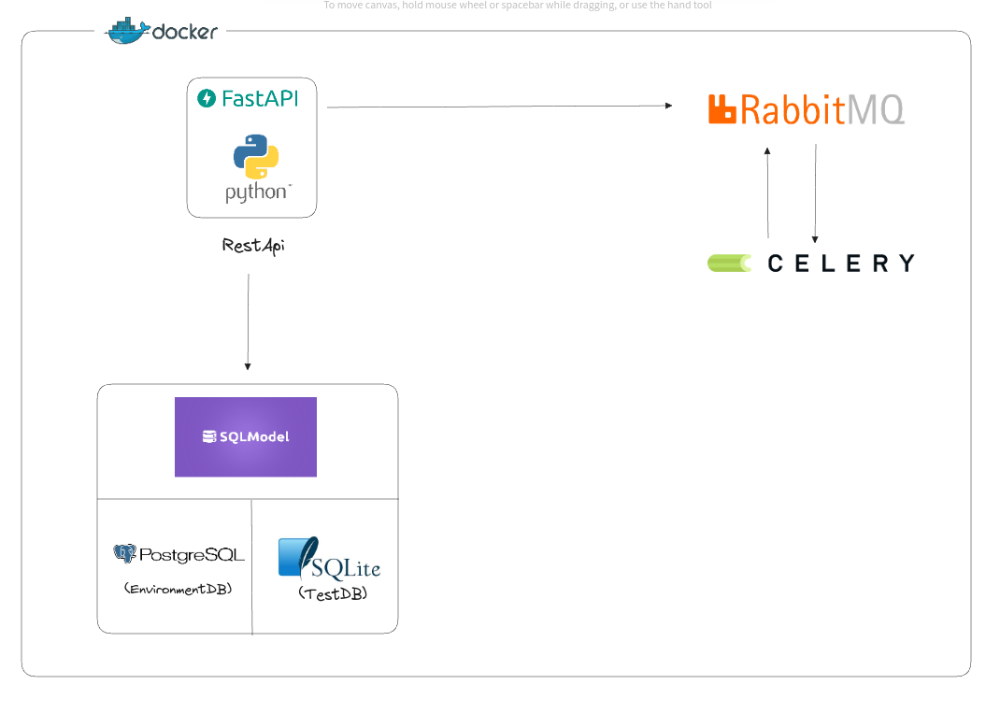
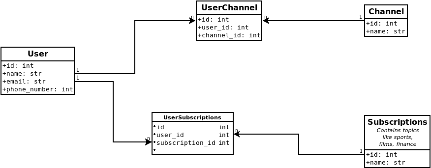

# GilaSW (Notification API) - Code Challenge Gerardo Benitez
This is a project created to resolve the code challenge. 
The project is an API created using:

* FastAPI
* Docker
* SQLModel (SqlAchemy)
* RabbitMQ
* Celery
* PostgreSql / SQLite

## Requirements

Python 3.9+

## Project

### Setup environment
1. copy .env.example to .env
2. set environment variables

### Run It: option 1 with docker

1. Start the project 

```sh
docker-compose up
```

### Run It: option 2 manually
1. Start Postgres DB
   ```sh
   docker-compose up postgres
   ```
2. Start api
   ```sh
   python3 -m venv .venv
   source .venv/bin/activate
   pip install requirements.txt
   set -a
   source .env
   set +a
   uvicorn app.main:app --host 0.0.0.0 --port 9009 --reload
   
   ```
3. Start RabbitMq
    ```sh
   docker-compose up rabbit
   ```
4. Start Celery

    in other console
   ```sh
   
   source .venv/bin/activate
   set -a
   source .env
   set +a
   celery -A app.core.celery_worker worker --loglevel=info -Q report_tabs
   
   ```

### Logs
The applications logs are located in 
```
./logs/app.logs
```

### Working

#### Try Api using curl
```
curl --location --request POST 'http://localhost:9009/api/notification' \
--header 'Content-Type: application/json' \
--data-raw '{
    "category": "films", 
    "message": "Dec 24, world premiere of the movie Avatar 3"
}'
```

#### Api Documentation
Go to [http://localhost:9009/docs](http://localhost:9009/docs).



## Architecture



## Database


